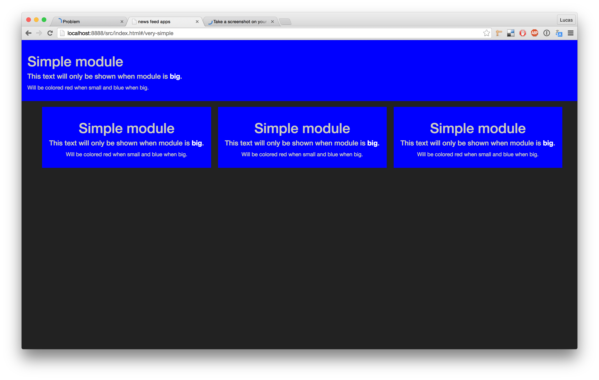
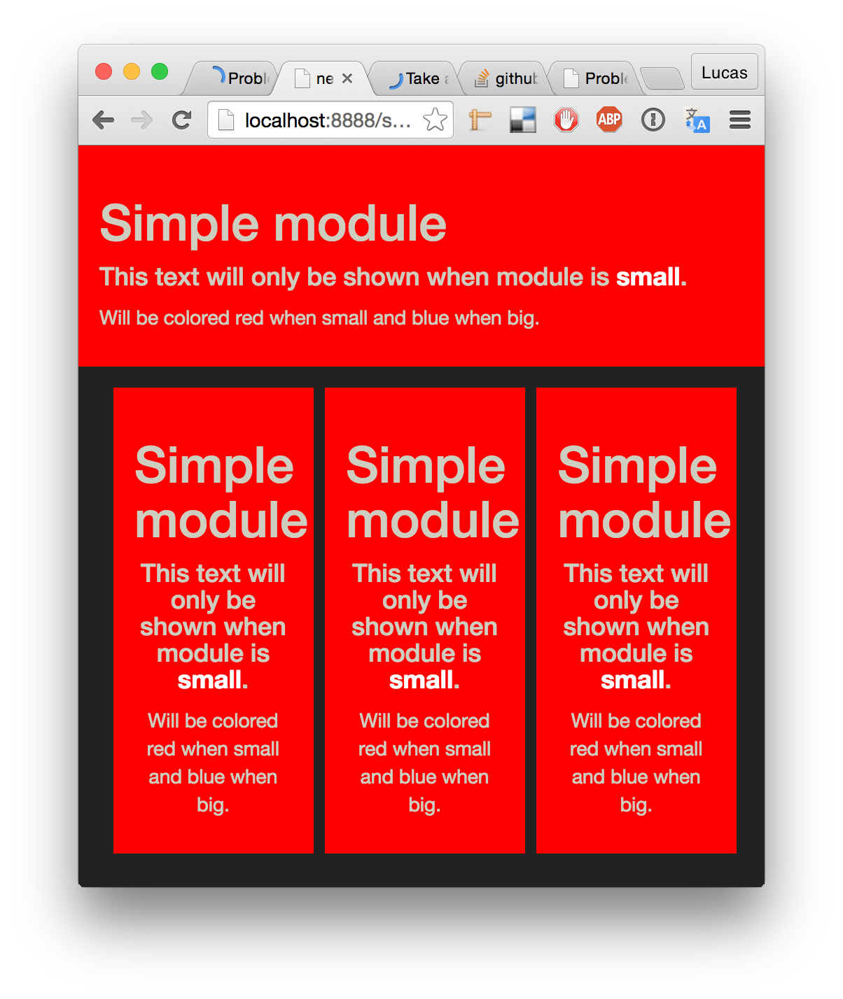
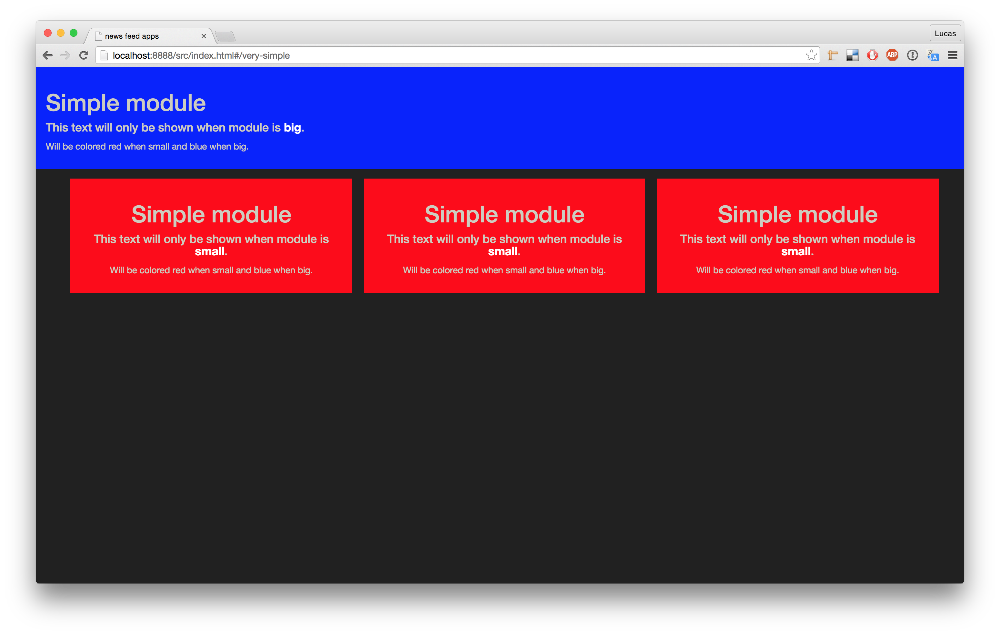
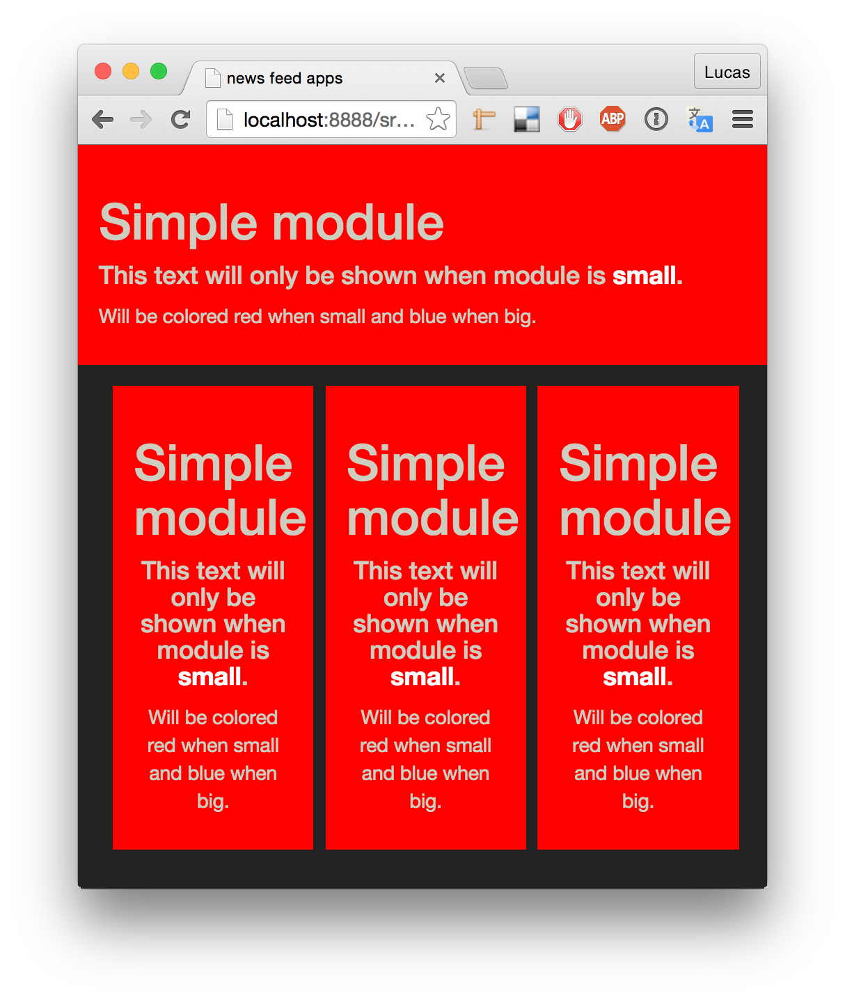

Problem formulation
===================
A very simple example that will describe the essence of the problem.

#### What we want
We want to develop a responsive module that will respond and react to dimension changes of *the module*. The module that we want to develop will be named *simple-module* and should be composable in any layout configurations.

## simple-module
The HTML code for the module is the following:
```html
<div class="very-simple">
    <h1>Simple module</h1>
    <h4 class="show-big">This text will only be shown when module is <b>big</b>.</h4>
    <h4 class="show-small">This text will only be shown when module is <b>small</b>.</h4>
    <p>Will be colored red when small and blue when big.</p>
</div>
```

The requirements for the module are:

1. When the module has <= 500px of width, the ```show-big``` class should hide the target elements.
2. When the module has > 500px of width, the ```show-small``` class should hide the target elements.
3. When the module has <= 500px of width, the background of the module should be colored red.
4. When the module has > 500px of width, the background of the module should be colored blue.
5. **The module should be responsible for fulfilling the above requirements by itself.**

What is meant with ```When the module has ... of width``` is that when the outer div ```very-simple``` is allowed by the container element to expand to the stated amount of width.

What we need in order to fulfill the requirements of the module, *is to have conditional CSS rules to style elements differently by the container dimensions*.

### Approach 1: media queries
By using media queries, we can apply conditional CSS rules by the viewport dimension like so:

```css
@media (max-width: 500px) {
    .very-simple {
        background: red;
    }

    .show-big {
        display: none;
    }

    .show-small {
        display: block;
    }
}

@media (min-width: 501px) {
    .very-simple {
        background: blue;
    }
    
    .show-big {
        display: block;
    }

    .show-small {
        display: none;
    }
}
```

#### Test
Let's test the module that we have created with approach 1. Here we see a test application that uses 4 "instances" of the simple-module module. One is placed in the top and allowed to expand freely in width. The other 3 are given 31% of the viewport width, and are centered horizontally.

Following is the interesting code for the example application. Don't mind the special syntax. The important thing is that the simple-module CSS and HTML is loaded from the module, not defined in the app.

```html
<div>
    <very-simple></very-simple>
</div>
<div class="row">
    <div class="col"><very-simple></very-simple></div>
    <div class="col"><very-simple></very-simple></div>
    <div class="col"><very-simple></very-simple></div>
</div>
```

```css
@import "../../modules/very-simple/very-simple.css";

.row {
    margin: 15px;
    text-align: center;
}

.row .col {
    width: 31%;
    margin-left: 1%;
    display: inline-block;
}
```

This results in the following:




The module placed at the top satisfies all requirements, since it reacts to the style breakpoint at 500px. However, the three instances beneth it are all broken. In the first picture the individual width of the lower modules are 440px, so the modules should be colored red and display the other text. As we can see in picture 2, the lower modules only change style state when the upper also changes state. *This is because all modules style themself relative to the viewport, disregarding the actual size that they have.*

So this approach works properly when the module is allowed to expand its width to the whole viewport. If the dimension of the module is constrained by the user somehow, this approach will break.

We failed to create the described module with this approach, since the module is not layout-agnostic. In other words, the module is not composible in any layout.

### Approach 2: element queries framework

By using the third-party *element queries* framework, we can satisfy all requirements of the simple-module. The framework (named ELQ and will appear as ```elq``` in the code) will be plugin-based, so there will probably be different syntaxes for different app requirements. Let's consider this simple example, which will use the *breakpoints* plugin (```elq-breakpoints``` in code).

The ```elq-breakpoints``` plugin is able to listen to arbitrary elements for dimension changes, and will apply classes to the elements to reflect the dimension changes. Consider the following example:

```html
<div elq elq-breakpoints elq-breakpoints-width="300 500 800">
    <h1>I can do element queries!</h1>
</div>
```

The div that we want to perform element queries on has received three special attributes. The first attribute ```elq``` tells the framework that the element and all the children of it will be targeted for element queries. The second attribute ```elq-breakpoints``` tells the framework that this element should use the breakpoints plugin. The breakpoints plugin will read the third attribute ```elq-breakpoints-width``` and will then know that the module want to use the width breakpoints of 300, 500 and 800 pixels for element queries.

Then, what will happen is that the framework will listen to the element for dimension changes, and then add appropriate classes to the element. If the element has the width of 550 pixels, it will have the following classes:

* ```elq-width-above-300```
* ```elq-width-above-500```
* ```elq-width-under-800```

Of course, the height works in the same way. Now let's see how this can be used to make the simple-module behave as we want.

The HTML of the module will look like this:

```html
<div class="very-simple" elq elq-breakpoints elq-breakpoints-width="500">
    <h1>Simple module</h1>
    <h4 class="show-big">This text will only be shown when module is <b>big</b>.</h4>
    <h4 class="show-small">This text will only be shown when module is <b>small</b>.</h4>
    <p>Will be colored red when small and blue when big.</p>
</div>
```

And the CSS of the module will look like this:


```css
.very-simple.elq-width-under-500 {
    background: red;
}

.very-simple.elq-width-under-500 .show-big {
    display: none;
}

.very-simple.elq-width-under-500 .show-small {
    display: block;
}

.very-simple.elq-width-above-500 {
    background: blue;
}

.very-simple.elq-width-above-500 .show-big {
    display: block;

.very-simple.elq-width-above-500 .show-small {
    display: none;
}
```

Of course by using a CSS preprocessor such as LESS or SASS, the CSS can instead be written like this:
```css
.very-simple.elq-width-under-500 {
    background: red;

    .show-big {
        display: none;
    }

    .show-small {
        display: block;
    }
}

.very-simple.elq-width-above-500 {
    background: blue;
    
    .show-big {
        display: block;
    }

    .show-small {
        display: none;
    }
}
```

Which is very similar to the media query approach. Only here, we target the ```.very-simple``` element for queries, instead of the viewport.

#### Test
Let's test the module with the new approach. The app layout will be the same, but we of course need to include the framework in the app in order for the modules to work. Apart from including the framework, the developer of the app do not need to change anything. Including the framework can be done like so:
```html
<script src="elq.js"></script>
<script src="elq-breakpoints.js"></script>
```

Our app then looks like this:




As we can see, the module behaves exactly as we want it to. All the requirements are satisfied.

## Conclusion
As illustrated in this document, it is impossible to write responsive modules that are encapsulated and layout-agnostic with media queries. Since media queries is the only native way of having responsive elements, there is clearly a need for native element queries. Because native element queries impose complications to browser implementations and complexity to the CSS language, it will probably be a very long time before we will see native element queries (if it will ever happen). By crafting a third-party framework for element queries (a prolyfill) we can create such modules today.

All the images in this document that shows the simple-module module are screenshots of an actual working example powered by the experimental build of the ELQ framework.
